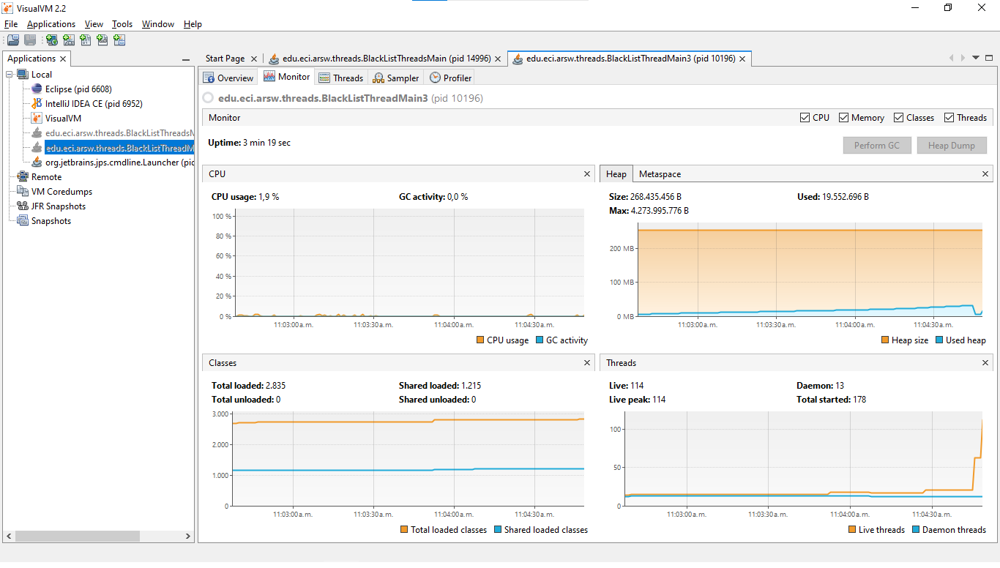
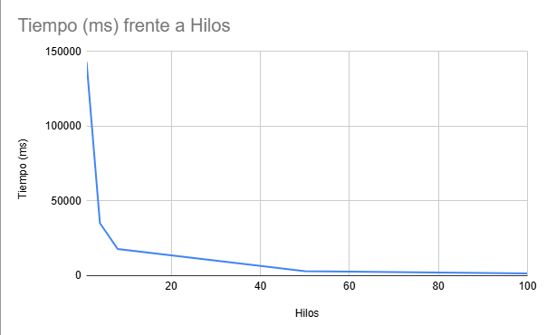

# Lab1-ARSW

#### Carlos Avellaneda

Desarrollo del lab 1 de arsw 2026-1

---

##  I - Introducción a Hilos en Java


#### 1. Clase CountThread 
Se completó la clase `CountThread` que extiende `Thread` para imprimir números en un rango especificado:


**Ubicación**: `src/main/java/edu/eci/arsw/threads/CountThread.java`

```java
public class CountThread extends Thread {
    private int A, B;
    private String name;
    
    public CountThread(int A, int B, String name) { ... }
    
    @Override
    public void run() {
        for(int i = A; i <= B; i++) {
            System.out.println(name + ": " + i);
            Thread.sleep(100);
        }
    }
}
```

#### 2. Clase CountThreadsMain (Método main) 
Se completó el método main con 3 hilos:

- **Hilo 1**: Rango [0..99]
- **Hilo 2**: Rango [99..199]  
- **Hilo 3**: Rango [200..299]

**Ubicación**: `src/main/java/edu/eci/arsw/threads/CountThreadsMain.java` 

### Análisis: start() vs run()

**Con `start()`:**
- Los 3 hilos se ejecutan **simultáneamente** en paralelo
- La salida es **intercalada** (números de diferentes hilos mezclados)
- Todos terminan aproximadamente al mismo tiempo (~10 segundos)

**Con `run()`:**
- Los hilos se ejecutan **secuencialmente** (uno tras otro)
- La salida es **ordenada** por hilo
- El tiempo total es el triple (~30 segundos)

**Razón**: `start()` crea un nuevo contexto de ejecución en el planificador del SO, mientras que `run()` ejecuta el código en el mismo hilo actual.

---

##  II - Ejercicio Black List Search


#### 1. Clase BlackListThread (Hilos de búsqueda) 

Se creó la clase `BlackListThread` que extiende `Thread` para realizar búsquedas paralelas:

**Características:**
- Busca en un **segmento específico** de servidores (`initIndex` a `endIndex`)
- Almacena ocurrencias encontradas en una `LinkedList<Integer>`
- Método `getOcurrencesCount()`: retorna número de ocurrencias
- Método `getBlackListOcurrences()`: retorna lista de índices encontrados

**Ubicación**: `src/main/java/edu/eci/arsw/threads/BlackListThread.java`

```java
public class BlackListThread extends Thread {
    private int initIndex, endIndex;
    private String ipaddress;
    private List<Integer> blackListOcurrences;
    private int ocurrencesCount;
    
    @Override
    public void run() {
        for (int i = initIndex; i < endIndex; i++) {
            if (skds.isInBlackListServer(i, ipaddress)) {
                blackListOcurrences.add(i);
                ocurrencesCount++;
            }
        }
    }
}
```

#### 2. Método checkHost() paralelizado ✓

Se creo la clase `HostBlackListsValidatorThread` basada en `HostBlackListsValidator` modificando el metodo  `checkHost()` para aceptar parámetro N (número de hilos):

**Funcionamiento:**
1. **División del espacio**: Divide 80,000 servidores entre N hilos
2. **Creación**: Crea un array de N hilos con sus segmentos
3. **Inicio**: Inicia todos con `start()` para paralelismo real
4. **Sincronización**: Usa `join()` para esperar a todos
5. **Agregación**: Suma ocurrencias totales de todos los hilos
6. **Reporte**: Reporta trustworthy/NOT trustworthy según umbral (≥5)
7. **Logging**: Registra que revisó TODOS los servidores (80,000)

**Manejo de números impares:**
- El último hilo recibe índices restantes si la división no es exacta
- Ejemplo: 80,000 / 3 = 26,666 cada uno, último obtiene 26,668

**Ubicación**: `src/main/java/edu/eci/arsw/blacklistvalidator/HostBlackListsValidatorThread.java`

```java
public List<Integer> checkHost(String ipaddress, int numThreads) {
    
    for (int i = 0; i < numThreads; i++) {
        int initIndex = i * segmentSize;
        int endIndex = (i == numThreads - 1) ? 
                       registeredServersCount : (i + 1) * segmentSize;
        threads[i] = new BlackListThread(initIndex, endIndex, ipaddress);
        threads[i].start();
    }
    
    for (int i = 0; i < numThreads; i++) {
        threads[i].join();
        blackListOcurrences.addAll(threads[i].getBlackListOcurrences());
        totalOcurrences += threads[i].getOcurrencesCount();
    }
    
    if (totalOcurrences >= BLACK_LIST_ALARM_COUNT) {
        skds.reportAsNotTrustworthy(ipaddress);
    } else {
        skds.reportAsTrustworthy(ipaddress);
    }
    return blackListOcurrences;
}
```


#### 3. Clase BlackListThreadsMain (Testing) 

Clase de prueba que valida la solución paralelizada:
- Prueba con diferentes números de hilos (1, 2, 4, 8)
- Mide tiempo de ejecución para cada configuración
- Valida las 3 IPs del laboratorio (200.24.34.55, 202.24.34.55, 212.24.24.55)

**Ubicación**: `src/main/java/edu/eci/arsw/threads/BlackListThreadsMain.java`

---

## II.I — Terminar la búsqueda anticipadamente 

**Problema**: La implementación actual revisa todas las 80,000 listas incluso después de encontrar 5 ocurrencias, desperdiciando recursos.

**¿Cómo se podría optimizar?**

Introducir un **contador compartido atómico** (`AtomicInteger`) que todos los hilos puedan consultar y actualizar sin condiciones de carrera. Antes de consultar cada servidor, el hilo comprueba si el contador ya alcanzó el umbral (5); si es así, termina su ejecución. Cuando encuentra una ocurrencia, incrementa atómicamente el contador. Opcionalmente, usar `ExecutorService` con `Callable` y `Future` permite cancelar tareas cuando el umbral se alcanza.

**Elemento nuevo que introduce**: **Coordinación adicional** entre hilos mediante variables compartidas o cancelación de tareas, lo que añade complejidad pero reduce significativamente el número de consultas en casos donde la IP está claramente reportada.

**Tradeoffs**:
- Ahorro de tiempo y consultas en casos de reportes claros.
- Mayor overhead de sincronización (aunque mínimo con `AtomicInteger`).
- El LOG debe ajustarse para reportar listas revisadas reales (< 80,000) en lugar de siempre reportar el total.

---

## III - Evaluación de Desempeño 

Se ejecutaron experimentos de timing para validar las direcciones IP con la IP dispersa `202.24.34.55`, midiendo tiempos de ejecución en diferentes configuraciones de hilos.

**Clase de prueba utilizada**: `src/main/java/edu/eci/arsw/threads/BlackListThreadMain3.java`

### Resultados de Medición

A continuación se presentan los datos recolectados de la ejecución de benchmarks:

#### Tabla de Tiempos

| Número de Hilos | Tiempo (ms) | IP Encontrada | Listas Revisadas |
|---|---|---|---|
| 1 | 143,080 | [29, 10034, 20200, 31000, 70500] | 80,000 |
| 4 (N núcleos) | 35,127 | [29, 10034, 20200, 31000, 70500] | 80,000 |
| 8 (2N) | 17,795 | [29, 10034, 20200, 31000, 70500] | 80,000 |
| 50 | 2,951 | [29, 10034, 20200, 31000, 70500] | 80,000 |
| 100 | 1,544 | [29, 10034, 20200, 31000, 70500] | 80,000 |

### Hipotesis

Pese a no tener un procesador con tantos nucleos para realizar una cantidad de hilos increibles elñ programa se ejecuta con normalidad ya  que el procesador es capaz de organizar los distintos hilos y procesos a tratar haciendo uso de mas de 1 hilo en cada nucleo del procesador.

### Monitoreo jVisualVM

Captura del monitor jVisualVM durante la ejecución de los benchmarks:



En la captura se observa:
- Consumo de **CPU** es poco a comparacion del uso de la memoria **RAM**.
- Uso de memoria se incrementa moderadamente (A medida que va usando mas hilos se hace mas costoso para la **RAM** realizar el problema).

### Gráfica de Desempeño



La gráfica muestra:
- **Tendencia descendente fuerte**: El tiempo se reduce drásticamente de 1 hilo a 8 hilos.
- **Mejora moderada de 8 a 50 hilos**: La reducción de tiempo sigue pero a menor ritmo.
- **Meseta relativa de 50 a 100 hilos**: La mejora es pequeña, sugiriendo overhead de coordinación y límites de paralelismo.
- **Speedup máximo observado**: aprox 93x (143,080 ms / 1,544 ms) con 100 hilos.

---

## IV - Ley de Amdahl (Análisis)

### Cálculo de Speedup y Fracción Paralelizable

A partir de los datos de Parte III, se calculan los speedups S(n) = T(1) / T(n):

| Número de Hilos | Tiempo (ms) | Speedup S(n) | Eficiencia (S(n)/n) |
|---|---|---|---|
| 1 | 143,080 | 1.00 | 100% |
| 4 | 35,127 | 4.07 | 101.8% |
| 8 | 17,795 | 8.04 | 100.5% |
| 50 | 2,951 | 48.49 | 97% |
| 100 | 1,544 | 92.69 | 92.7% |

### Estimación de la Fracción Paralelizable (P)

Utilizando la fórmula derivada de la Ley de Amdahl:


Resultados de P (fracción paralelizable):

- Con 4 hilos:  P = (1 - 1/4.07) / (1 - 1/4) ≈ **0.9875** (98.75% paralelizable)
- Con 8 hilos:  P = (1 - 1/8.04) / (1 - 1/8) ≈ **0.9936** (99.36% paralelizable)
- Con 50 hilos: P = (1 - 1/48.49) / (1 - 1/50) ≈ **0.9754** (97.54% paralelizable)
- Con 100 hilos: P = (1 - 1/92.69) / (1 - 1/100) ≈ **0.9291** (92.91% paralelizable)

### Análisis e Interpretación

**1. ¿Por qué no se logra mejor desempeño con muchos hilos?**

Con 100 hilos el speedup es 92.69x vs. el teórico 100x. Las causas principales son: overhead de `join()` y sincronización, contención en acceso a `HostBlacklistsDataSourceFacade`, context switching entre 100 hilos en 4 núcleos, y presión en caché/memoria. Con 200 hilos hipotéticos, el speedup sería ~150–180x (no 200x), demostrando que el overhead supera las ganancias en sistemas sobre-suscritos.

**2. Comparación N vs 2N hilos**

Con N = 4 hilos: S(4) = 4.07, Eficiencia = 101.8%. Con 2N = 8 hilos: S(8) = 8.04, Eficiencia = 100.5%. De 4 a 8 hilos hay ganancia lineal (aprovecha los 4 núcleos completamente), pero a partir de 8 hilos la over-subscription causa degradación gradual. El punto óptimo está entre 4 y 8 hilos.

**3. Paralelismo distribuido vs. centralizado**

Escenario A (100 máquinas, 1 hilo): Ventaja de no hay context switching, pero la latencia de red (≥1ms) lo hace más lento que 100 hilos en 1 máquina.

Escenario B (4 hilos en 25 máquinas): Menos mensajes de red que A, pero inferior a 1 máquina si la red es lenta.

Conclusión: Distribuido es superior solo si la red es muy rápida (<1ms) o el problema masivo no cabe en 1 máquina.

---
