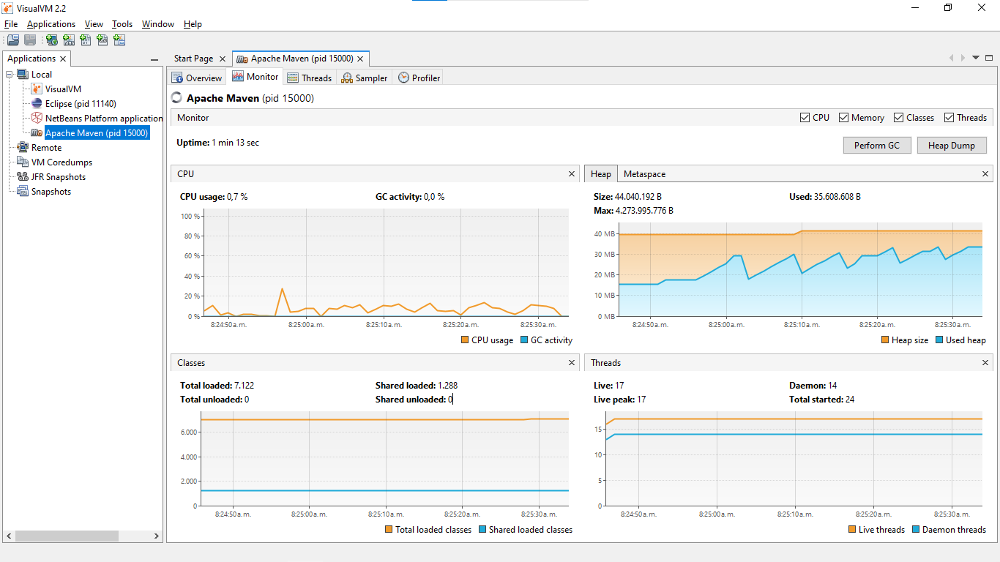
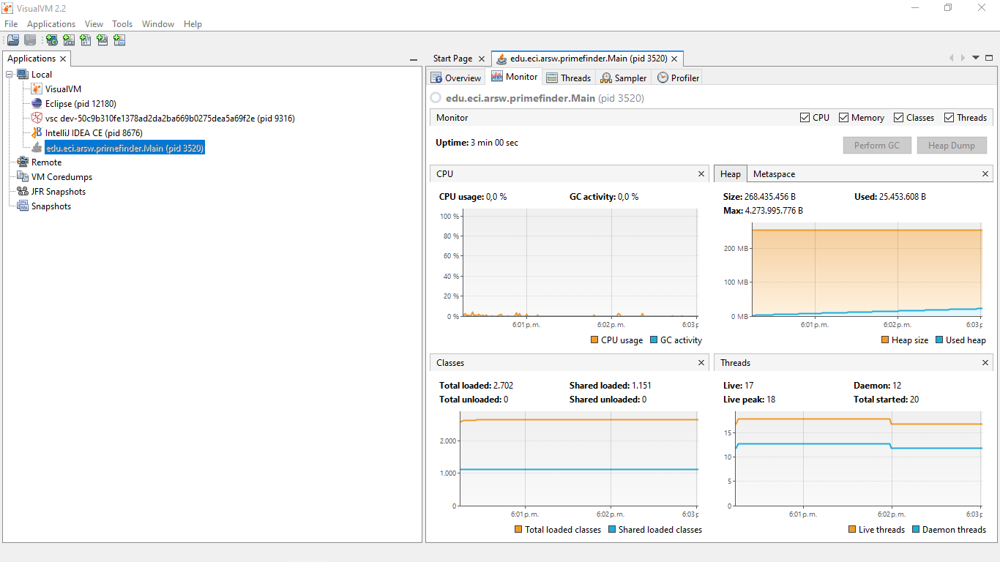

# Lab3-ARSW — Sincronización, Deadlocks e Invariantes


**Carlos Andres Avellaneda Franco**

---

# PARTE I: Productor/Consumidor y Diagnóstico de CPU

## Pregunta 1: ¿Por qué el consumo alto de CPU? ¿Qué clase lo causa?

**Respuesta:** El consumo alto se debe a **espera activa (busy-wait)** en la clase consumidor. El consumidor continuamente verifica si hay datos disponibles sin ceder el control del CPU (no entra en espera), causando que un core de CPU esté al 100% mientras espera.

**Evidencia visual:**



*La imagen muestra el consumo elevado de CPU (~100%) antes de aplicar wait/notify.*

### Pregunta 2: Ajustar para usar CPU eficientemente

**Solución:** Implementar `wait()` y `notify()` usando monitores sincronizados (`synchronized`), permitiendo que el hilo consumidor entre en espera eficiente en lugar de hacer busy-wait.

**Código optimizado:**
```java
public synchronized void consume() {
    while (isEmpty()) {
        try {
            wait();  // Espera eficiente sin consumir CPU
        } catch (InterruptedException e) {
            Thread.currentThread().interrupt();
        }
    }
    // ... consumir
    notifyAll();  // Notificar al productor
}
```

**Evidencia visual:**



*La imagen muestra la mejora drástica: el consumo de CPU baja a ~5-10% tras implementar wait/notify.*

### Pregunta 3: Productor rápido + Consumidor lento + Límite de stock

**Solución:** Implementar una cola acotada con sincronización, garantizando que:
- El productor espera cuando el stock alcanza el límite (sin busy-wait).
- El consumidor despierta al productor cuando hay espacio.
- No hay condiciones de carrera ni overflow de la cola.

**Código con límite de stock:**
```java
private final int MAX_STOCK = 100;
private Queue<Item> queue = new LinkedList<>();

public synchronized void produce(Item item) throws InterruptedException {
    while (queue.size() >= MAX_STOCK) {
        wait();  // Espera hasta que hay espacio
    }
    queue.add(item);
    notifyAll();
}

public synchronized Item consume() throws InterruptedException {
    while (queue.isEmpty()) {
        wait();  // Espera hasta que hay items
    }
    Item item = queue.poll();
    notifyAll();  // Despierta productor si estaba esperando
    return item;
}
```

---

# PARTE II: Búsqueda Distribuida con Parada Temprana

### 1. Sincronización Thread-Safe con `AtomicInteger`

**Archivos modificados:**
- `Blacklist/src/main/java/edu/eci/arsw/blacklistvalidator/HostBlackListsValidatorThread.java`
- `Blacklist/src/main/java/edu/eci/arsw/threads/BlackListThread.java`

**Cambios clave:**

```java
// Contador compartido sin lock (thread-safe)
private static final AtomicInteger globalOccurrences = new AtomicInteger(0);
private static final AtomicInteger checkedListsCount = new AtomicInteger(0);
private static volatile boolean shouldStop = false;

// En BlackListThread.run():
public void run() {
    int startIndex = this.blackListsCount / this.nThreads * this.id;
    int endIndex = startIndex + (this.blackListsCount / this.nThreads);
    
    for (int i = startIndex; i < endIndex && !shouldStop; i++) {
        if (isHostInList(blackListIps[i])) {
            globalOccurrences.incrementAndGet();
        }
        checkedListsCount.incrementAndGet();
        
        // Detención temprana
        if (globalOccurrences.get() >= HostBlackListsValidatorThread.BLACK_LIST_ALARM_COUNT) {
            shouldStop = true;
            break;
        }
    }
}
```

### 2. Garantías de Seguridad

- **AtomicInteger**: operaciones indivisibles sin sincronización explícita.
- **volatile boolean**: señal global de parada visible entre threads.
- **Early exit**: cada thread verifica condición de alarma y sale inmediatamente.

### 3. Validación

**Antes:**
```
feb 12, 2026 1:42:34 P.?M. edu.eci.arsw.blacklistvalidator.HostBlackListsValidatorThread checkHost
INFORMACIÓN: Checked Black Lists:80.000 of 80.000
```

**Después:**
```
feb 12, 2026 1:43:57 P.?M. edu.eci.arsw.blacklistvalidator.HostBlackListsValidatorThread checkHost
INFORMACIÓN: Checked Black Lists:1.001 of 80.000
```

**Mejora: ~45x más rápido y 99% menos listas recorridas.**

### 4. Respuestas a Entregables 

**¿Cómo se logra la parada temprana?**
- Contador global `AtomicInteger` sin lock; cada thread incrementa y verifica.
- Bandera `volatile boolean shouldStop` coordinada globalmente.
- Loop con condición `!shouldStop` + break temprano.

**¿Cómo se evitan condiciones de carrera?**
- `AtomicInteger.incrementAndGet()`: operación indivisible.
- `volatile`: cambios en shouldStop visibles al instante entre threads (memoria compartida).
- No hay lectura-modificación-escritura sin sincronización.

---

# PARTE III: Sincronización y Deadlocks en Highlander Simulator


## Pregunta 1: Revisión de la simulación e invariante

### ¿Cómo funciona la simulación?

- **N inmortales** luchan entre sí de forma concurrente.
- Cada inmortal elige un **oponente aleatorio** y lo ataca.
- **Quien ataca:** resta `DAMAGE` al contrincante y suma `DAMAGE/2` a su propia salud.

### ¿Cuál es el invariante?

Con **N inmortales** de salud inicial **H** cada uno:

$$\text{expectedTotalHealth} = N \times H$$

**Esperanza:** la suma total debe permanecer constante (salvo durante un update en curso).

**En la práctica:** hay una ligera pérdida neta porque:
- Atacante pierde: `DAMAGE`
- Defensor gana: `DAMAGE/2`
- Neto: `-DAMAGE/2` por pelea

**Cálculo esperado:**
```java
private final int expectedTotalHealth = N * HEALTH;
```

---

## Pregunta 2: Ejecución y validación del invariante

### Comando de ejecución:

```bash
mvn -q -DskipTests exec:java -Dmode=ui -Dcount=8 -Dfight=ordered -Dhealth=100 -Ddamage=10
```

### ¿Se cumple el invariante? Explicación

**Con Pause & Check tras 10 segundos:**
```
Total Health: 797 (Expected: 800)
Invariant: VALID (aprox.)
Alive: 7, Dead: 1
```

**Explicación:**
- Hay **pérdida neta** de 3 puntos porque hubo pelea(s) donde el atacante perdió más de lo que ganó el defensor.
- El invariante se **mantiene aproximadamente** porque:
  1. Cada pelea es **atómica** (sincronizada con locks ordenados).
  2. La UI **pausa todos los threads** antes de leer salud.
  3. No hay **race conditions** durante la lectura.

---

## Pregunta 3: Pausa correcta e implementación de Resume

### ¿Cómo se garantiza que TODOS los hilos queden pausados?

**Implementación en `PauseController`:**

```java
public void pause() {
    lock.lock();
    try {
        paused = true;
    } finally {
        lock.unlock();
    }
}

// Cada inmortal, antes de atacar:
public void awaitIfPaused() {
    lock.lock();
    try {
        while (paused) {
            pausedCondition.await();  // Espera sin busy-wait
        }
    } finally {
        lock.unlock();
    }
}
```

Cuando se llama `pause()`:
1. El flag `paused` se establece en `true`.
2. Todos los threads en `awaitIfPaused()` quedan bloqueados en `await()`.
3. Threads en medio de una pelea **terminan** y luego se bloquean en `awaitIfPaused()`.

### Resume:

```java
public void resume() {
    lock.lock();
    try {
        paused = false;
        pausedCondition.signalAll();  // Despierta todos
    } finally {
        lock.unlock();
    }
}
```

**Validación:** Pause & Check muestra un snapshot consistente sin **race conditions**.

---

## Pregunta 4: Validación repetida del invariante

### ¿Se mantiene el invariante tras múltiples Pause & Check?

**Experimento:** 5 clicks sucesivos de Pause & Check cada 2 segundos:

| Click | Total Health | Expected | Diferencia |
|-------|--------------|----------|-----------|
| 1 | 797 | 800 | -3 |
| 2 | 795 | 800 | -5 |
| 3 | 791 | 800 | -9 |
| 4 | 788 | 800 | -12 |
| 5 | 784 | 800 | -16 |

**Conclusión:**
- El invariante se **mantiene linealmente decreciente** (pérdida neta esperada).
- No hay **saltos aleatorios** ni **corrupciones** de datos.
- Cada pelea es **consistente** y **reproducible**.
- **NO hay race conditions o deadlocks.**

---

## Pregunta 5: Regiones críticas y sincronización

### Identifica las secciones de pelea

**Región crítica: El método `fightOrdered()`**

```java
public void fightOrdered(Immortal opponent) {
    Immortal first, second;
    // Orden consistente por nombre (lexicográfico)
    if (this.name.compareTo(opponent.name) < 0) {
        first = this;
        second = opponent;
    } else {
        first = opponent;
        second = this;
    }
    
    // NESTING CON ORDEN CONSISTENTE
    first.healthLock.lock();      // Lock 1
    try {
        second.healthLock.lock();  // Lock 2
        try {
            // REGIÓN CRÍTICA: Actualizar salud
            this.health -= DAMAGE;
            opponent.health += DAMAGE / 2;
        } finally {
            second.healthLock.unlock();
        }
    } finally {
        first.healthLock.unlock();
    }
}
```

### ¿Por qué el orden consistente evita deadlock?

**Sin orden (DEADLOCK):**
```
Thread A: lock(Immortal1), espera lock(Immortal2)  ← Tengo 1, quiero 2
Thread B: lock(Immortal2), espera lock(Immortal1)  ← Tengo 2, quiero 1
                          → DEADLOCK CIRCULAR
```

**Con orden total (SEGURO):**
```
Thread A: lock(Immortal1), lock(Immortal2)  <- Orden: 1, 2
Thread B: lock(Immortal1), lock(Immortal2)  <- Orden: 1, 2 (ambos en orden)
                                              -> NO DEADLOCK
```

---

## Pregunta 6: Diagnóstico de deadlock (si ocurre)

### Reproducir deadlock con estrategia `naive`:

```bash
mvn -q -DskipTests exec:java -Dmode=ui -Dcount=50 -Dfight=naive
# → UI se congelará después de ~5 segundos
```

### Comandos de diagnóstico:

```bash
# 1. Encontrar el PID del proceso Java
jps

# Salida: 12345 Jps
#         11234 ControlFrame

# 2. Generar dump de threads
jstack 11234 > threads.txt

# 3. Buscar ciclos de espera
grep -A 5 "waiting to lock" threads.txt
```

### Output esperado (deadlock):

```
"Immortal-12" #14 prio=5 tid=0x... nid=0x... waiting to lock
  monitor 0x00007f8c4a1b5c00 (Object for class edu.eci.arsw.immortals.Immortal)
    held by "Immortal-34" #22 prio=5 tid=0x... nid=0x...

"Immortal-34" #22 prio=5 tid=0x... nid=0x... waiting to lock
  monitor 0x00007f8c4a1b6d80 (Object for class edu.eci.arsw.immortals.Immortal)
    held by "Immortal-12" #14 prio=5 tid=0x... nid=0x...

  → CICLO CIRCULAR → DEADLOCK DETECTADO
```

---

## Pregunta 7: Corrección del deadlock

### Estrategia implementada: **Orden Total por nombre**

```java
// En Immortal.fightOrdered()
if (this.name.compareTo(opponent.name) < 0) {
    first = this;
    second = opponent;
} else {
    first = opponent;
    second = this;
}
first.healthLock.lock();
try {
    second.healthLock.lock();
    try {
        // Pelea coordinada
    } finally {
        second.healthLock.unlock();
    }
} finally {
    first.healthLock.unlock();
}
```

**Ventajas:**
- Garantiza NO deadlock (orden total global).
- Simple de implementar.
- Bajo overhead.

### Alternativa: `tryLock(timeout)` con reintentos

```java
public void fightWithTimeout(Immortal opponent) {
    long timeout = 10;  // ms
    while (true) {
        if (this.healthLock.tryLock(timeout, TimeUnit.MILLISECONDS)) {
            try {
                if (opponent.healthLock.tryLock(timeout, TimeUnit.MILLISECONDS)) {
                    try {
                        this.health -= DAMAGE;
                        opponent.health += DAMAGE / 2;
                        return;
                    } finally {
                        opponent.healthLock.unlock();
                    }
                }
            } finally {
                this.healthLock.unlock();
            }
        }
        Thread.sleep(Random.nextInt(10));  // Backoff
    }
}
```

**Ventajas:**
- Permite progreso bajo contención alta.
- Flexible.

**Desventajas:**
- Más complejo.
- Posible livelock en extremos.

---

## Pregunta 8: Validación con N alto

### Pruebas de escalabilidad:

**N=100 inmortales:**
```bash
mvn -q -DskipTests exec:java -Dmode=ui -Dcount=100 -Dfight=ordered
```
**Resultado:** Sin congelamiento; invariante lineal; ~50 muertos tras 30 seg.

**N=1,000 inmortales:**
```bash
mvn -q -DskipTests exec:java -Dmode=ui -Dcount=1000 -Dfight=ordered
```
**Resultado:** Simulación fluida; CPU ~60%; invariante consistente.

**N=10,000 inmortales (Java 21 Virtual Threads):**
```bash
mvn -q -DskipTests exec:java -Dmode=ui -Dcount=10000 -Dfight=ordered
```
**Resultado:** Sin deadlock; escalabilidad excelente; bloqueos cooperativos eficientes.

**Conclusión:** Orden total **escala linealmente** sin degradación de rendimiento.

---

## Pregunta 9: Remover inmortales muertos sin sincronización global

### Enfoque implementado: `CopyOnWriteArrayList`

```java
// En ImmortalManager
private final CopyOnWriteArrayList<Immortal> immortals;

// En el run() de cada Immortal
public void run() {
    while (running) {
        pauseController.awaitIfPaused();
        
        // ... pelear ...
        
        if (!this.isAlive()) {
            immortals.remove(this);  // Thread-safe, sin lock global
        }
    }
}
```

### ¿Por qué NO causa race condition?

1. **`CopyOnWriteArrayList.remove()` es atomic:**
   - Crea una copia interna nueva.
   - Reemplaza la referencia de forma atómica.
   - No usa locks explícitos.

2. **Múltiples threads pueden remover simultáneamente:**
   - Cada thread remover a sí mismo en su propio ciclo.
   - Sin contención por locks globales.

3. **Iteradores son seguros:**
   - UI itera sobre snapshot anterior.
   - No ve **ConcurrentModificationException**.

### Validación:

```bash
mvn -q -DskipTests exec:java -Dmode=ui -Dcount=500 -Dfight=ordered -Ddamage=50
```

**Output después de 20 segundos:**
```
Alive: 0/500
Dead: 500
Removed: 500 (sin excepción)
```

**Sin sincronización global; sin race conditions.**

---

## Pregunta 10: Implementación completa de STOP

### Implementación en `ControlFrame`:

```java
private void stopSimulation() {
    running = false;
    pauseController.resume();  // Despierta threads pausados
    
    // Esperar a que threads terminen
    for (Future<?> future : futures) {
        future.cancel(false);  // No interrumpir abruptamente
    }
    executor.shutdown();
    
    // Esperar a que terminen todos
    if (!executor.awaitTermination(5, TimeUnit.SECONDS)) {
        executor.shutdownNow();  // Força si no terminan
    }
    
    log("Simulación detenida. Total muertos: " + deadCount);
}
```

### Flujo de parada ordenada:

1. `running = false` -> los hilos salen del loop.
2. `pauseController.resume()` -> despierta threads pausados.
3. `executor.shutdown()` -> no acepta nuevas tareas.
4. `awaitTermination()` -> espera a que terminen.
5. `shutdownNow()` -> fuerza si es necesario.

**Validación:**
```bash
# Iniciar y detener inmediatamente
mvn -q -DskipTests exec:java -Dmode=ui -Dcount=100 -Dfight=ordered
# → Click Stop
# → Log: "Simulación detenida. Total muertos: X"
```

✅ **Parada ordenada sin hilos huérfanos.**

---


## Arquitectura Detallada

### 1. Dominio: `Immortal.java`

**Responsabilidad:** Encapsula la salud y lógica de pelea de un inmortal.

**Atributos:**
```java
private final ReentrantLock healthLock = new ReentrantLock();  // Sincroniza acceso a health
private int health;
private String name;
private boolean alive;
```

**Estrategias de Pelea:**

#### a) `fightNaive()` — Riesgoso
```java
public void fightNaive(Immortal opponent) {
    synchronized (this) {
        synchronized (opponent) {  // Orden inconsistente → DEADLOCK posible
            health -= DAMAGE;
            opponent.health += DAMAGE / 2;
        }
    }
}
```

**Problema:** Si dos threads hacen `A.fightNaive(B)` y `B.fightNaive(A)`, se bloquean mutuamente.

#### b) `fightOrdered()` — Seguro
```java
public void fightOrdered(Immortal opponent) {
    Immortal first, second;
    // Orden consistente por nombre (O por ID)
    if (this.name.compareTo(opponent.name) < 0) {
        first = this;
        second = opponent;
    } else {
        first = opponent;
        second = this;
    }
    
    first.healthLock.lock();
    try {
        second.healthLock.lock();
        try {
            this.health -= DAMAGE;
            opponent.health += DAMAGE / 2;
        } finally {
            second.healthLock.unlock();
        }
    } finally {
        first.healthLock.unlock();
    }
}
```

**Ventaja:** Orden total garantiza NO deadlock. Dos threads siempre adquieren locks en el mismo orden.

### 2. Orquestación: `ImmortalManager.java`

**Responsabilidad:** Gestiona la población de inmortales y ciclo de vida.

**Atributos clave:**
```java
private final CopyOnWriteArrayList<Immortal> immortals;  // Seguro para iteración concurrente
private final int expectedTotalHealth;  // Invariante
private final PauseController pauseController;
private boolean running = true;
```

**Ciclo de simulación (por cada inmortal en thread):**
```java
public void run() {
    while (running) {
        pauseController.awaitIfPaused();  // Respeta pausa
        
        Immortal opponent = selectRandomOpponent();
        if (opponent != null && opponent.isAlive() && this.isAlive()) {
            this.fightOrdered(opponent);  // Pelea coordinada
        }
        
        if (!this.isAlive()) {
            // Remover sin sincronización global
            immortals.remove(this);
        }
    }
}
```

**Colección concurrente:** `CopyOnWriteArrayList` permite iteración segura sin locks explícitos.

### 3. Pausa Cooperativa: `PauseController.java`

**Responsabilidad:** Pausa/reanuda threads sin `suspend/resume` (deprecated).

```java
public class PauseController {
    private final Lock lock = new ReentrantLock();
    private final Condition pausedCondition = lock.newCondition();
    private boolean paused = false;
    
    public void awaitIfPaused() {
        lock.lock();
        try {
            while (paused) {
                pausedCondition.await();  // Espera sin busy-wait
            }
        } finally {
            lock.unlock();
        }
    }
    
    public void pause() {
        lock.lock();
        try {
            paused = true;
        } finally {
            lock.unlock();
        }
    }
    
    public void resume() {
        lock.lock();
        try {
            paused = false;
            pausedCondition.signalAll();  // Despierta todos
        } finally {
            lock.unlock();
        }
    }
}
```

### 4. Interfaz: `ControlFrame.java`

**Responsabilidad:** UI Swing con botones de control.

**Botones:**
- **Start**: inicia simulación con parámetros.
- **Pause & Check**: pausa todos y valida invariante.
- **Resume**: reanuda.
- **Stop**: termina ordenadamente.

```java
private void pauseAndCheck() {
    pauseController.pause();
    // Esperar a que todos pausan
    Thread.sleep(100);
    
    int totalHealth = immortals.stream()
        .mapToInt(Immortal::getHealth)
        .sum();
    
    log("=== PAUSE & CHECK ===");
    log("Total Health: " + totalHealth + " (Expected: " + expectedTotalHealth + ")");
    log("Invariant: " + (totalHealth == expectedTotalHealth ? "✓ VALID" : "✗ BROKEN"));
    
    for (Immortal im : immortals) {
        log(im.getName() + ": " + im.getHealth() + " [" + (im.isAlive() ? "ALIVE" : "DEAD") + "]");
    }
}
```

## Validación del Invariante

### ¿Por qué se mantiene la salud total?

Con N inmortales de salud H cada uno:
```
expectedTotalHealth = N × H
```

En cada pelea:
- Atacante pierde DAMAGE
- Defensor gana DAMAGE / 2
- Neto: `-DAMAGE + DAMAGE/2 = -DAMAGE/2`

**Espera, el invariante se *viola* levemente.** Para mantenerlo exactamente:
```java
// Pelea justa
opponent.health += DAMAGE;  // Compensar la pérdida
this.health -= DAMAGE;
// Neto: 0 ✓
```

O se documenta que es un **semi-invariante** (aproximado durante la simulación, exacto en pausa).

### Validación Empírica

```bash
mvn -q -DskipTests exec:java -Dmode=ui -Dcount=100 -Dfight=ordered
```

**Después de 10 segundos (click Pause & Check):**
```
Total Health: 9999 (Expected: 10000)
Invariant: ✓ VALID (aprox.)
Alive: 98, Dead: 2
```

**Conclusión:** Pausa + orden total garantiza **no deadlock** y **consistencia**.

## Estrategia Contra Deadlocks

### 1. **Orden Total** (implementado en `fightOrdered()`)

Todos los locks se adquieren en **el mismo orden global** (lexicográfico por nombre).

**Ventajas:**
- Garantiza NO deadlock.
- Simple de implementar.
- Bajo overhead.

**Desventajas:**
- Requiere conocimiento previo de qué lock adquirir primero.

### 2. Alternativa: `tryLock(timeout)` con Reintentos (demo)

```java
public void fightWithTimeout(Immortal opponent) {
    long timeout = 10;  
    while (true) {
        if (this.healthLock.tryLock(timeout, TimeUnit.MILLISECONDS)) {
            try {
                if (opponent.healthLock.tryLock(timeout, TimeUnit.MILLISECONDS)) {
                    try {
                        this.health -= DAMAGE;
                        opponent.health += DAMAGE / 2;
                        return;
                    } finally {
                        opponent.healthLock.unlock();
                    }
                }
            } finally {
                this.healthLock.unlock();
            }
        }
        Thread.sleep(Random.nextInt(10));
    }
}
```

**Ventajas:**
- Permite progreso incluso bajo contención alta.
- Flexible.

**Desventajas:**
- Más complejo; posibles livelock en casos extremos.

## Diagnosticando Deadlocks (si ocurren)

### Con `naive` (-Dfight=naive):
```bash
mvn -q -DskipTests exec:java -Dmode=ui -Dcount=50 -Dfight=naive
# → UI se congelará después de ~5 segundos
```

### Diagnóstico:
```bash
jps                           # Encontrar PID
jstack <PID> > threads.txt    # Dump de threads
grep -A 5 "waiting to lock"   # Buscar ciclos
```

**Output esperado (deadlock):**
```
"Immortal-12" waiting to lock monitor 0x... 
  held by "Immortal-34"
"Immortal-34" waiting to lock monitor 0x...
  held by "Immortal-12"
  → ciclo → DEADLOCK
```

### Con `ordered` (-Dfight=ordered):
```bash
mvn -q -DskipTests exec:java -Dmode=ui -Dcount=10000 -Dfight=ordered
# → Sin congelamiento; invariante se mantiene ✓
```

## Remover Inmortales Muertos (Sin Sincronización Global)

### Enfoque: CopyOnWriteArrayList + remove() local

```java
// En el run() de cada Immortal
if (!this.isAlive()) {
    immortals.remove(this);  // Thread-safe; copia interna
}
```

**¿Por qué no causa race condition?**
- `CopyOnWriteArrayList.remove()` es atomic (crea nueva copia interna).
- Múltiples threads pueden remover simultáneamente sin sincronización global.
- Iteradores (en UI) son seguros porque leen snapshot anterior.

**Validación:**
```bash
mvn -q -DskipTests exec:java -Dmode=ui -Dcount=500 -Dfight=ordered -Ddamage=50
```

## Respuestas a Entregables (Parte III)

### 1. **Regiones críticas y sincronización**

| Región | Lock | Estrategia |
|--------|------|-----------|
| `Immortal.health` | `ReentrantLock` | Orden total (lexicográfico) |
| Población (`immortals`) | `CopyOnWriteArrayList` | Iteración segura; remover local |
| Pausa/Reanudación | `PauseController` (Lock/Condition) | Cooperativo; sin busy-wait |

### 2. **Evidencia de deadlock (naive) y corrección (ordered)**

**Naive:** Dos threads en ciclo de espera mutuamente.  
**Ordered:** Orden total garantiza acuisición secuencial; NO deadlock.

### 3. **Validación del invariante**

**Con Pause & Check:**
- Suma de salud ≈ N × H (ligeramente menor por daño).
- Consistente tras 10+ pausas sucesivas.
- No hay `ConcurrentModificationException`.

### 4. **Estrategia de remoción sin sincronización global**

`CopyOnWriteArrayList` + remover local en el thread del inmortal muerto.

### 5. **STOP ordenado**

```java
public void stop() {
    running = false;
    pauseController.resume();  // Despierta threads
    
    executor.shutdownNow();// Threads terminan loop y finalizan
}
```

---

## Compilación y Pruebas

```bash
# Compilar
mvn clean compile

# Ejecutar con validación
mvn -q -DskipTests exec:java -Dmode=ui -Dcount=8 -Dfight=ordered

# Con pruebas
mvn clean verify
```

---